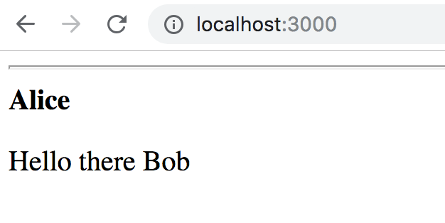
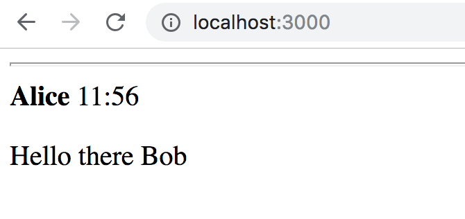

# React.js Exercise 2 – React Props

> Complete ALL the exercises in this section. Ask thomas.devine@lyit.ie for help or post an *Issue* on your GitHub repository.

### Clone the Remote Repository

Accept the GitHub Classroom invitation to this exercise @ the BlackBoard page.

Copy the clone URL from your new repository ReactJS-<YOURACCOUNT>

Type these commands into your Git Bash client:

```
$ cd /<DRIVE>/xampp/htdocs   
$ git clone <URL> ReactJS
$ cd ReactJS
$ ls
$ git status
```

Check your `htdocs` folder. You should have a new folder called `ReactJS` with some files in it.


## Part 1 - HelloWorld Props

> Make sure you have the React app running as outlined in the lecture slides.
	
1.	Open and modify ``src/index.js`` so that your the `<HelloWorld>` component is now passed a property `name='Bob'` like below:

	```javascript
	import React from 'react';
	import ReactDOM from 'react-dom';
	import HelloWorld from './HelloWorld.js';

	ReactDOM.render(<HelloWorld name='Bob' />, document.getElementById('root'));
	```

1.	Then modify ``src/HelloWorld.js`` so that your the `<HelloWorld>` component renders "Hello Bob"

1.	Test it works using the link [http://localhost:3000/](http://localhost:3000/)

1.	Make sure you use the React console tab to view the component you just created.


## Part 2 - Message Component

You will create a new Message component and render it.

1.	Create a new component file `Message.js` in the project `src` folder.

1.	Add to `Message.js` the following code

	```javascript
	import React from 'react';

	class Message extends React.Component {
	    render() {
	      var d = new Date();
	      return (
	        <div>
	          <hr/>
	          <b>name</b> time
	          <p>message</p>
	        </div>
	      );
	    }
	}
	export default Message;
	```

1.	Next, open and modify ``src/index.js`` so that your the `<Message>` component is rendered:

	```javascript
	import React from 'react';
	import ReactDOM from 'react-dom';
	import Message from './Message.js';

	ReactDOM.render(<Message />, document.getElementById('root'));
	```

1.	Modify the Message component to accept properties for the name and message.  For example, the following code:

	```javascript
	import React from 'react';
	import ReactDOM from 'react-dom';
	import Message from './Message.js';

	ReactDOM.render(<Message name='Alice' message='Hello there Bob' />, document.getElementById('root'));
	```

	should render this:

	

1.	Next modify the Message component again to display the current time the message was posted:

	
	
	Use info [here](https:/www.w3schools.com/jsref/jsref_obj_date.asp) to guide you.


1.	Modify the code in `index.js` to see how multiple Message components may be added

	```javascript
	import React from 'react';
	import ReactDOM from 'react-dom';
	import Message from './Message.js';

	ReactDOM.render(
		<div>
			<Message name='Alice' message='Hello there Bob' />
			<Message name='Bob' message='How are you Alice?' />
		</div>, document.getElementById('root'));
	```

		You should see two messages now.


## Part 3 - MessageBoard Component

Let's get our messages from an array of JSON message objects this time.

1.	Add this code to your `Message.js` component

	```javascript
	const messages = [
			{name: "Alice", message: "Hello there Bob" },
			{name: "Bob", message: "How are you Alice?" },
			{name: "Alice", message: "Good Bob" }
	]

	class MessageBoard extends React.Component {
		render(){
	      return(
	        <div>
	          {
	            messages.map(function (message) {
	              return <Message name={message.name} message={message.message} />
	            })
	          }
	        </div>
	      )
	    }
	}
	export { MessageBoard };
	```

	Note the `messages` array and how the `map()` function is used to render Message components using this data.

1.	Next, modify the code in `index.js` to use the MessageBoard component:

	```javascript
	import React from 'react';
	import ReactDOM from 'react-dom';
	import { MessageBoard } from './Message.js';

	ReactDOM.render(<MessageBoard />, document.getElementById('root'));
	```

	You should see all the messages now.