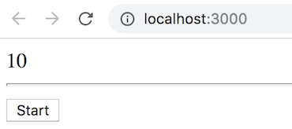
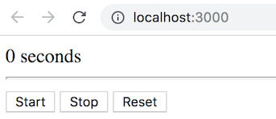
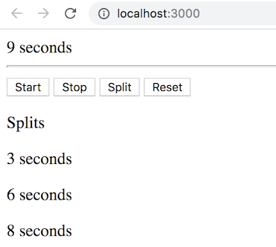

# React.js Exercise 4 – React Event Handling & Lifecyle Events

> Complete ALL the exercises in this section. Ask thomas.devine@lyit.ie for help or post an *Issue* on your GitHub repository.

## Fetch latest Repository Branch

```
$ cd /DRIVE/xampp/htdocs/d3
$ git pull --no-edit https://github.com/noucampdotorgRESTAPI2019/ReactJS.git latest
$ git status

```

## Part 1 - MyButton Clicked 

> Make sure you have the React app running as outlined in the lecture slides.
	
1.	Modify the code in [MyButton.js](/MyButton.js) so when the button is clicked the caption changes to "hi" instead


## Part 2 - Timer  

1.	Modify the code in `Timer.js` so a button controls when to start the timer as shown here:

	

	This timer had the time property initially set to 10.

## Part 3 - StopWatch

1.	Add a new component called `<StopWatch>` in a file `StopWatch.js` to your React project `src` folder.  

1.  When initially rendered have it start at 0 (zero) and count upwards one seconds per second.

1.  Then, add _Start_, _Stop_ and _Reset_ buttons to control the stopwatch as shown below:

    

1.	Finally, add a _Split_ button and attempt to record splits as shown below:

    

	This is all functionality of the `<StopWatch>` component.

	_Hints_
	- This could be your state data:
	  ```javascript
	  this.state = { time: 0, splits : [] };
	  ```
	- Add splits to `splits` array using array `concat()` function


## Part 4 - Timer Revisted 

1.	Add the [AutoTimer.js](../AutoTimer.js) component to your React project `src` folder.

1.	Modify `src/index.js` so that your the `<AutoTimer>` component is rendered using this code:

	```javascript
	import React from 'react';
	import ReactDOM from 'react-dom';
	import AutoTimer from './AutoTimer.js';

	ReactDOM.render(<AutoTimer />, document.getElementById('root'));
	```
	
	Test it works using the link http://localhost:3000/

1.	Now modify the component to use two of the _Component Lifecycle_ methods

		Use `componentDidMount()` to start the timer and store returned ID value in a class variable `this.timerID`

		Use `componentWillUnmount()` to clear the timer (use `clearInterval()`)


## Part 5 - Switch Component

1.	Add the [Switch.js](../Switch.js) component to your React project `src` folder.

1.	Modify `src/index.js` so that your the `<Switch>` component is rendered using this

		```javascript
		import React from 'react';
		import ReactDOM from 'react-dom';
		import Switch from './Switch.js';

		ReactDOM.render(<Switch />, document.getElementById('root'));
		```
		
		Test it works using the link http://localhost:3000/

1.	Modify the component to use a ternary operator to render the state of the switch

1.	Modify the component to use the Previous State of the `on` when updating the it