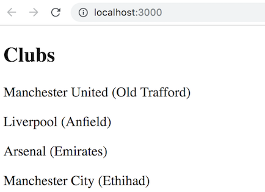
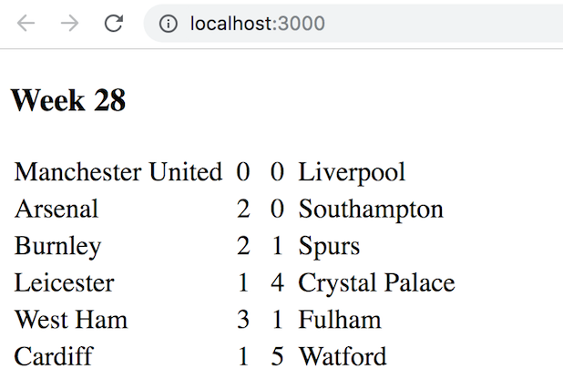
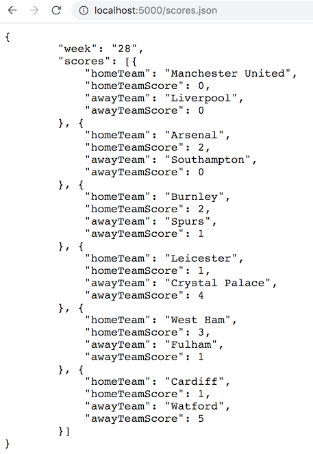

# React.js Exercise 5 – React Fetch

> Complete ALL the exercises in this section. Ask thomas.devine@lyit.ie for help or post an *Issue* on your GitHub repository.

## Fetch latest Repository Branch

```
$ cd /DRIVE/xampp/htdocs/d3
$ git pull --no-edit https://github.com/noucampdotorgRESTAPI2019/ReactJS.git latest
$ git status

```

## Part 1 - File Server Setup

This simple FileServer is used to serve some JSON content for our ReactJS fetches.

1.	Open a Command Prompt window and change into the directory `ReactJS/fileServer`

    ```
    $ cd ReactJS/fileServer
    ```

    Setup the node_modules needed with:

    ```
    $ npm install
    ```

    and run the FileServer:

    ```
    $ node index.js
    ```

    Check it's working by using this URL [http://localhost:5000/clubs.json](http://localhost:5000/clubs.json) in your browser


## Part 2 - Fetch Clubs  

1.	Open and modify the code for the component `<ClubV2>` to render this:

	

    from the data fetched from [http://localhost:5000/clubs.json](http://localhost:5000/clubs.json)


## Part 3 - TeamScores

1.	Examine the code for the component `<TeamScores>`.  It has state data for 6 EPL matches.  

1.	Modify the code to render this:

	

	Keep the state data in `TeamScores.js` for now.

## Part 4 - Fetch TeamScores

1.	Remove the state JSON data from the `<TeamScores>` component so the state looks like this:

	```javascript
	this.state = {};
	```
1.	Add the score data to a new `scores.json` file on the FileServer that renders this when requested:

	

1.	Now fetch this data in the `<TeamScores>` component so that it renders this again:

	


## Part 5 - Fetch Clubs Every 5 Seconds

In this exercise we'll revisit the `<ClubsV2>` component to request club data every 5 seconds.

1.	Modify the `componentDidMount()` method to use this code:

	```javascript
	componentDidMount() {    
	var timer = setInterval( () => {
	                                fetch('http://localhost:5000/clubs.json')
	                                 .then((data) => data.json())
	                                 .then((data) => this.setState({clubs: data.clubs}))
	                               },5000);
	}
	```

1.	Observe the functionality of the component by using the _React console_

1.	Change a value in the `clubs.json` file and hopefully you'll see the update in the component.


## Part 6 - Fetch Scores Every 5 Seconds

1.	Modify the `<TeamScores>` component to fetch score data every 5 seconds too.  Test it works.