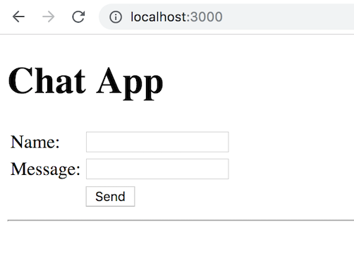
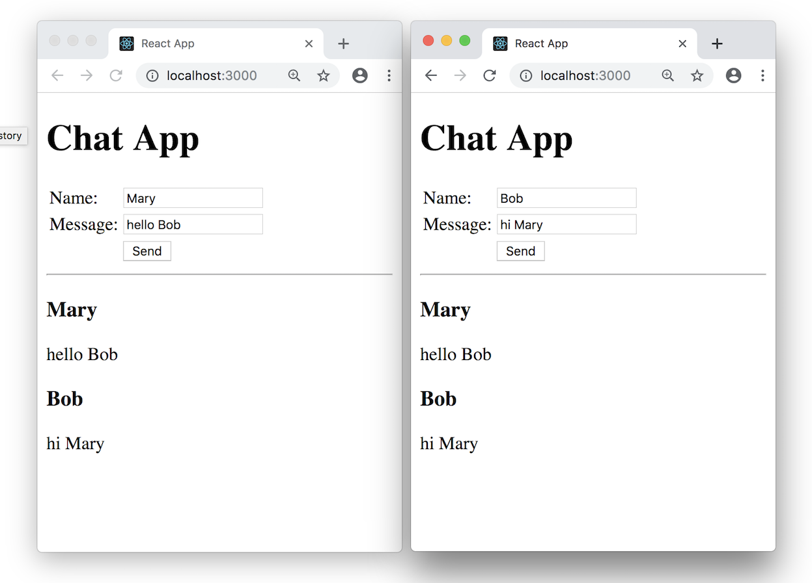

# React.js Exercise 6 – React ChatApp Component

> Complete ALL the exercises in this section. Ask thomas.devine@lyit.ie for help or post an *Issue* on your GitHub repository.


## Fetch latest Repository Branch

```
$ cd /DRIVE/xampp/htdocs/d3
$ git pull --no-edit https://github.com/noucampdotorgRESTAPI2019/ReactJS.git latest
$ git status

```

> In a previous module we implemented a Chat App using jQuery and Node.js Express.  See [here](https://media.heanet.ie/page/2d9df49a25ae7b0f01f13cd0ecc6aa7c).  In this exercise we'll implement it as a React Component.

## Part 1 - Chat Server Setup

This simple ChatServer is used to get messages and post new messages for our ReactJS fetches.  

1.	Open a Command Prompt window and change into the directory `ReactJS/chatServer`

    ```
    $ cd ReactJS/chatServer
    ```

    Setup the node_modules needed with:

    ```
    $ npm install
    ```

    and run the chatServer:

    ```
    $ node index.js
    ```

    Check it's working by using this URL [http://localhost:5000/get](http://localhost:5000/get) in your browser

1.  Open the source code in `index.js` & examine the code carefully.  Pay particular attention to the `messages` array.


## Part 2 - ChatApp

1.  Render the `<ChatApp>` component so you see this:

    

1.  Type your name and a few messages to see how it functions.

    Currently this component sends nothing and requests nothing from the Chat server.  We'll sort that in the next section.

1.	Open the source code in `ChatApp.js` & examine the code carefully.  Pay particular attention to new code for form event handling.


## Part 3 - ChatApp POST & GET

1.	In `ChatApp.js` uncomment the `fetch` command in `submit` method.

    This code posts any new message you type and send to the Chat server.

1.  Type and send a new message.  Then in a new browser window use this URL [http://localhost:5000/get](http://localhost:5000/get) again.

    You should see the message you sent returned to you.

1.  In the `componentDidMount()` method fetch any messages and update `state.messages` using `setState()`

1.  Modify the `<ChatApp>` component to fetch messages every 5 seconds.  Test it works.

1.  If everything is working you should be able to open TWO browser windows for the ChatApp and send messages to each other.

    

