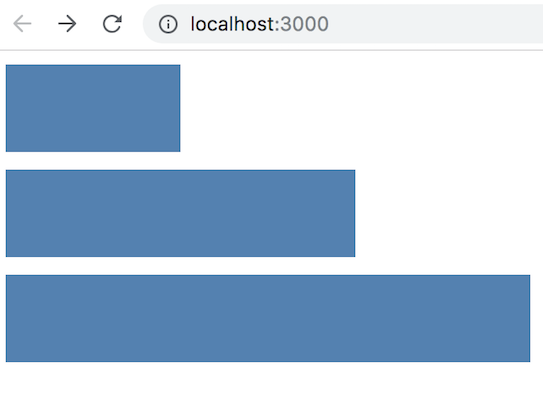
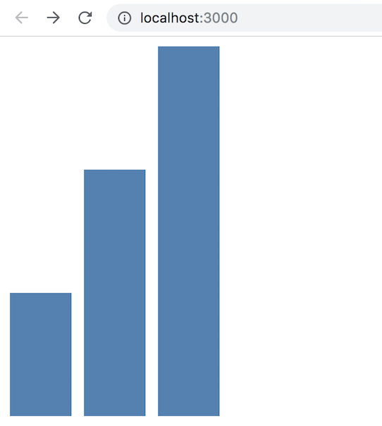

# React.js Exercise 7 – React D3 Component

> Complete ALL the exercises in this section. Ask thomas.devine@lyit.ie for help or post an *Issue* on your GitHub repository.

In this exercise we'll look at how to create a React D3 Component.

There are a number of ways to implement this but I've used a simple library solution called [react-d3-library](https://react-d3-library.github.io/)

## Fetch latest Repository Branch

```
$ cd /DRIVE/xampp/htdocs/d3
$ git pull --no-edit https://github.com/noucampdotorgRESTAPI2019/ReactJS.git latest
$ git status

```


## Part 1 - React D3BarChart Component

This is how our D3 component will look:




1.	Start by installing the ``react-d3-library`` module

    Open a Command Prompt window and change into the home folder of your React project.  This folder will have your ``package.json`` file.

    Install ``react-d3-library`` with command:

    ```
    $ npm install --save react-d3-library
    ```

1.  In your project ``src`` folder create the D3 chart in ``BarChart.js``:

    ```javascript
    import d3 from 'd3';
    var node = document.createElement('div');

    // draw your chart here
    var dataset = [100,200,300];
    var svg = d3.select(node).append("svg").attr("width",300).attr("height",200);
    var elements = svg.selectAll("rect")
                        .data(dataset);
    elements.enter().append("rect")
                        .attr("x",0)
                        .attr("y",function(d,i){ return i*60;})
                        .attr("width",function(d,i){ return d;})
                        .attr("height",50)
                        .attr("fill","steelblue");

    export default node;    

    ```

1.  Next, create the React Component ``<D3BarChart>`` to use this chart:

    ```javascript
    import React from 'react';
    import rd3 from 'react-d3-library';
    import node from './Barchart.js';        // load our D3 code
    const RD3Component = rd3.Component;

    class D3BarChart extends React.Component {
        constructor(props) {
            super(props);
            this.state = {d3: ''}
        }

        componentDidMount() {  
            this.setState( { d3: node } );
        }

        render() {
            return (
            <div>
                <RD3Component data={this.state.d3} />
            </div>
            )
        }
    }

    export default D3Chart;
    ```

1.  Finally, render the component ``<D3BarChart>`` in your ``src/index.js`` file.


## Part 2 - React D3ColumnChart Component

Create a new D3 component called ``<D3ColumnChart>`` that will look like:




